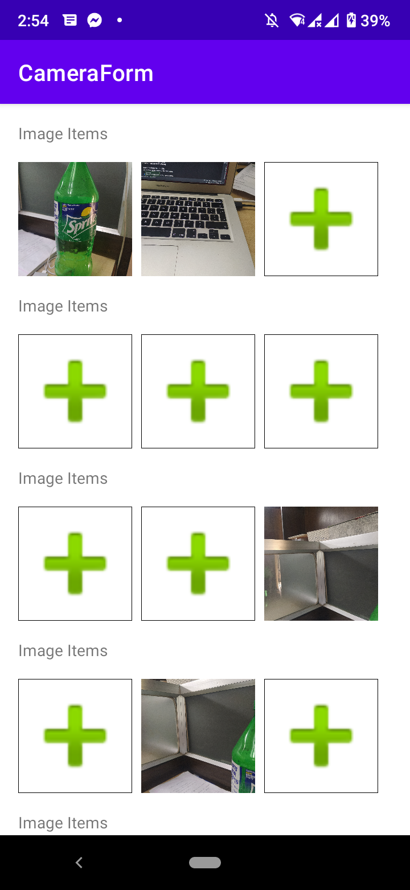

# CameraForm

Implementation example of displaying image into inner recycler view on capture image (compatible to android 10)

# Features:

1. Add dexture permission
2. Compatible with anroid 10
3. Full resoulation image accesible with file provider.

# Note:
If you change the package name it is recommended to change the file provider authority string from xml and string file.

xml:

```Java
 <provider
            android:name="androidx.core.content.FileProvider"
            android:authorities="com.skfaisal.cameraform.fileprovider"
            android:exported="false"
            android:grantUriPermissions="true">
            <meta-data
                android:name="android.support.FILE_PROVIDER_PATHS"
                android:resource="@xml/file_paths" />
 </provider>

```

string.xml:

```Java
<resources>
    ...
    <string name="fileautority_path">com.skfaisal.cameraform.fileprovider</string>
</resources>

```

# Screenshot:


